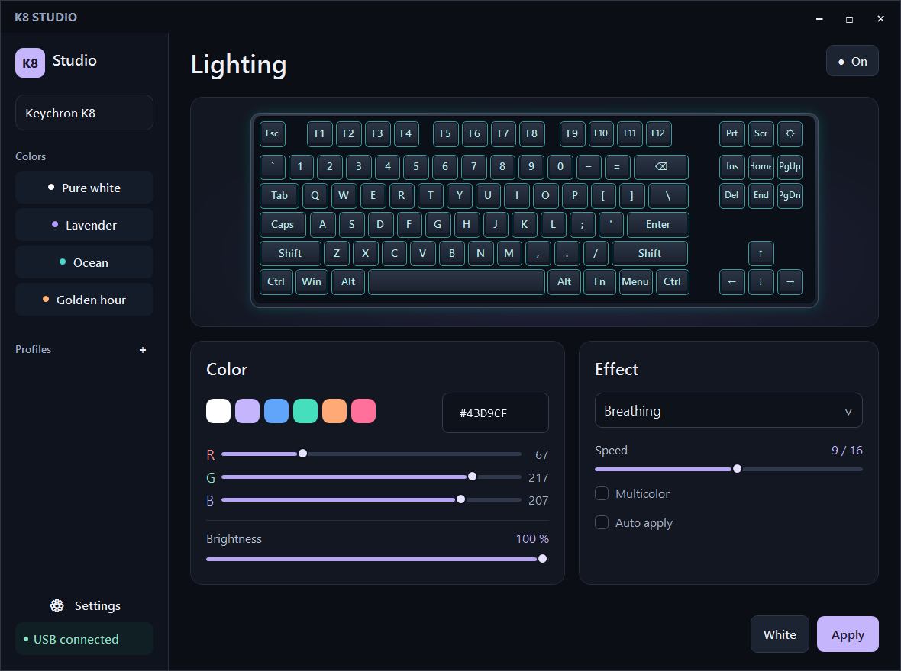

# K8 Studio

A free Windows lighting app for compatible **original RGB Keychron K8** keyboards. Choose a color, set brightness and effects, save profiles, or switch to steady white with one click.



## Download

[Download the latest release](https://github.com/Adweery/k8-studio/releases/latest). Choose `K8Studio-v0.1.1-windows-x64.zip`, extract it, and run `K8Studio.exe`.

Windows x64 with .NET Framework 4.8 is required. No installer or administrator privileges are needed. The app interface is in English. The executable is unsigned. Source code and SHA-256 checksums are provided alongside the download.

## Compatibility

This is an experimental release, tested on one original RGB K8 identified by its owner as K8Q2. Steady white lighting was visually confirmed. Compatibility with every K8 firmware or hardware revision has not been established.

The app accepts only devices matching all of these identifiers:

| Identifier | Required value |
| --- | --- |
| USB product name | `Keychron K8` |
| USB VID:PID | `05AC:024F` |
| Interface | `MI_00` |
| HID usage page / usage | `1 / 6` |
| HID feature report length | `65 bytes` |

Connect one matching keyboard by USB and move its physical switch to **Cable**. Bluetooth control is not included. K8 Pro, K8 Max, K8 V2, QMK/VIA models and white-backlight-only models are not supported by this release. Matching identifiers alone do not prove that an untested firmware behaves identically.

## Controls

**White** applies steady white at full brightness. **Apply** sends your selected settings. **On / Off** switches lighting. Use RGB sliders or HEX for color, then set **Brightness**, **Effect**, and animation **Speed**. **Auto apply** sends edits after a short pause. Select **+** beside Profiles to save a profile, or click an existing profile to recall it.
RGB sliders and the HEX field select a custom color. Some hardware effects choose their own colors. The app exposes 19 protocol effects; their appearance can vary with firmware. The keyboard preview illustrates color and brightness rather than measuring LEDs or reproducing every animation.

The physical Cable / Bluetooth / Off and Mac / Windows switches remain the way to change those modes.

## Keeping the light on

The tested keyboard lost its selected lighting after switching off and on. By default, K8 Studio reapplies the last successfully used setting at launch and when the compatible USB device reconnects. Keep the app running for reconnect restoration; minimizing leaves it running, while closing exits it. This does not make the setting permanently stored in keyboard firmware. If only the onboard lighting mode changes, press **White** or **Apply** again.

Optional start with Windows can be enabled in Settings. If you move the executable, save that option again to update its path. Disable the option before removing the application.

## Local data

Profiles and diagnostics are stored in `%LOCALAPPDATA%\K8Studio`. Optional startup uses the current user's `K8Studio` entry in `HKCU\Software\Microsoft\Windows\CurrentVersion\Run`.

The app has no network or telemetry code. It does not record keystrokes, flash firmware, remap keys, configure macros, or read the battery. Lighting transactions replace the keyboard's lighting effect/color table.

Version 0.1.1 restricts the app's native Windows API imports to System32. The settings reader rejects DTDs and external XML entities, limits file/document size, and validates profile names. See [SECURITY.txt](SECURITY.txt) for scope and limitations.

## Build and checks

Run `Build.ps1` in PowerShell on Windows x64 with .NET Framework 4.8 installed. It invokes the system C# compiler and bundles the XAML UI. No NuGet packages are used.

The following checks do not send USB lighting commands:

```powershell
.\K8Studio.exe --self-test protocol-test.txt
.\K8Studio.exe --ui-test ui-test.txt
```

Protocol tests check packet framing, effects, color, brightness, speed, direction, power and validation, as well as rejection of untrusted or oversized XML settings. UI tests check synchronization and control behavior. These checks do not establish hardware compatibility for additional keyboards.

If your original RGB K8 is not detected, use the repository's Issues tab to report its model, USB identifiers, firmware if known, and Windows version. Review logs for personal file paths before sharing them.

## License and credits

GNU GPL version 2 or later; see [COPYING.txt](COPYING.txt).

Lighting framing is adapted from [OpenRGB's KeychronKeyboardController](https://github.com/CalcProgrammer1/OpenRGB/tree/master/Controllers/KeychronKeyboardController), with credit to Morgan Guimard (2022). See [THIRD_PARTY_NOTICES.md](THIRD_PARTY_NOTICES.md).

K8 Studio is an independent community project and is not affiliated with Keychron.


